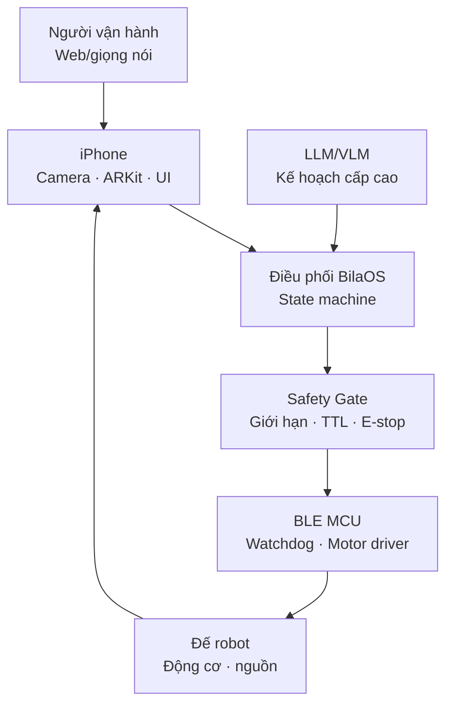

# 🤖 BilaOS Robot

<p align="center">
  
</p>

<h3 align="center">Biến iPhone thành bộ não của robot tự hành</h3>

<p align="center">
  Sổ tay DIY tiếng Việt từ A đến Z: lắp ráp, BLE, ARKit, điều khiển từ xa, LLM/VLA và an toàn chuyển động.
</p>

<p align="center">
  <a href="https://base27-cvnss.github.io/bilaOS-robot/"></a>
  <a href="LICENSE"></a>
  
</p>

> [!IMPORTANT]
> BilaOS Robot là giáo trình và bộ khung thử nghiệm, không phải sản phẩm an toàn chức năng. Luôn thử khi bánh xe nhấc khỏi mặt đất, dùng cầu chì, nút dừng khẩn vật lý và không vận hành gần người, vật nuôi, cầu thang hoặc đường giao thông.

## 🎯 Mục tiêu

Sau khóa học, bạn có thể xây một robot hai bánh dùng iPhone làm:

- 👁️ cảm biến RGB/LiDAR và ước lượng tư thế bằng ARKit;
- 🧠 bộ lập kế hoạch tác vụ bằng LLM/VLM;
- 📡 bảng điều khiển từ xa qua WebRTC;
- 🔵 bộ điều khiển BLE gửi vận tốc đến vi điều khiển;
- 🛡️ lớp giám sát an toàn với TTL, watchdog, giới hạn tốc độ và dừng khẩn.

## 🧱 Kiến trúc cốt lõi



LLM **không điều khiển PWM trực tiếp**. Mô hình chỉ được gọi các công cụ cấp cao như `đi_tới`, `quan_sát`, `dừng`; state machine và Safety Gate quyết định lệnh có hợp lệ hay không.

## 🍳 Lộ trình “sổ tay nấu ăn”

| Chặng | Thành phẩm kiểm chứng |
|---|---|
| 0. Hiểu đúng bài toán | Phân biệt tự hành, điều khiển từ xa và tự động hóa iPhone |
| 1. Chọn cấu hình | Mini 2WD an toàn, RoBart nâng cao hoặc cánh tay robot |
| 2. Lắp cơ khí & nguồn | Khung chắc, trọng tâm thấp, nguồn động cơ tách biệt |
| 3. Motor Guard | MCU dừng động cơ khi mất gói hoặc quá TTL |
| 4. iPhone + BLE | Điều khiển tay với nút dừng luôn khả dụng |
| 5. ARKit | Theo dõi 6DoF, mặt sàn và vật cản |
| 6. Tự hành cục bộ | Bản đồ chiếm chỗ → đường đi → bộ bám đường |
| 7. Điều khiển từ xa | Video + data channel WebRTC, dead-man switch |
| 8. LLM/VLM | Tool calling có allow-list và phê duyệt |
| 9. Kiểm thử | Bench → sàn trống → hành lang → nhiệm vụ có giám sát |

| 10. AI cục bộ | Chọn đúng LLM/VLM/VLA, đo bộ nhớ, độ trễ và nhiệt |
| 11. Agent bridge | So sánh native app, WDA, iPhone Mirroring, MCP và runtime robot |
| 12. VLA & robot arm | Pose iPhone → IK → demonstration → ACT/BitVLA |
| 13. Kiểm định | Test ladder, checklist phát hành và tiêu chí fail-closed |

👉 Mở **[khóa học trực tuyến](https://base27-cvnss.github.io/bilaOS-robot/)** để học 14 bài từng bước, đánh dấu tiến độ, sao chép mã và làm bài tự kiểm tra.

## 🧪 Mã mẫu

- [`examples/MotorGuard.ino`](examples/MotorGuard.ino): bộ bảo vệ động cơ cho ESP32, có sequence, TTL, watchdog và lệnh `STOP`.
- [`examples/RobotTools.swift`](examples/RobotTools.swift): mô hình công cụ cấp cao và Safety Gate tối giản trên iOS.

Mã mẫu được viết để giải thích kiến trúc. Trước khi nối động cơ thật, hãy thay chân GPIO, hệ số PWM, cực tính và giới hạn dòng theo phần cứng của bạn.

## 🧭 30 nguồn tham khảo được dùng đúng vai trò

| Nguồn | Giá trị đưa vào BilaOS | Không nên hiểu nhầm |
|---|---|---|
| [trzy/RoBart](https://github.com/trzy/RoBart) | iPhone Pro + ARKit + BLE + đế di động + LLM; nhánh WebRTC teleoperation | Mẫu cơ khí là bản thử nghiệm một chiếc; điều hướng còn thô |
| [trzy/robot-arm](https://github.com/trzy/robot-arm) | Teleoperation bằng pose iPhone, thu dữ liệu và ACT imitation learning | Là cánh tay robot, không phải đế tự hành |
| [rotbit/chatgpt-robot](https://github.com/rotbit/chatgpt-robot) | Siri/Shortcuts làm cổng lệnh thoại | Không chứa navigation hay motor safety |
| [gpt-embodiment-robot](https://github.com/AI-in-hindsight/gpt-embodiment-robot) | Mẫu ghép iPhone + MacBook + Arduino + GPT API | README rất ngắn; cần tự thẩm định mã |
| [PhoneAgent](https://github.com/rounak/PhoneAgent) | Agent loop và RPC tự động hóa iOS/Android | Điều khiển giao diện điện thoại, không điều khiển robot vật lý |
| [agentOS](https://github.com/claude-world/agentOS) | iPhone làm agent host, tool-use, Keychain và approval hook | Hệ sinh thái agent tổng quát, không phải navigation stack |
| [mobile-mcp](https://github.com/mobile-next/mobile-mcp) | MCP cho thao tác thiết bị thật/simulator | Cần cầu nối riêng để đi từ UI automation tới robot |
| [phone-harness](https://github.com/ShawnPana/phone-harness) | Điều khiển iPhone qua iPhone Mirroring, OCR và HID | Phụ thuộc Mac; không thay thế app robot native |
| [BitVLA-CoreAI](https://huggingface.co/mlboydaisuke/BitVLA-CoreAI) | VLA on-device dự đoán hành động 7-DoF cho thao tác | Phù hợp end-effector, không phải bộ điều hướng 2WD hoàn chỉnh |
| [Awesome-LLM-Robotics](https://github.com/GT-RIPL/Awesome-LLM-Robotics) | Bản đồ tài liệu về reasoning, planning, navigation, safety | Danh mục nghiên cứu, không phải repo robot chạy ngay |

Danh sách mở rộng đã được chuẩn hóa URL, loại trùng và phân nhóm thành: robot lõi, cầu nối iPhone, AI cục bộ, runtime, thị giác, nghiên cứu và tư liệu lịch sử. Xem **[SOURCES.md](SOURCES.md)** để đọc đủ 30 nguồn cùng giá trị sử dụng và giới hạn của từng nguồn.

## 🛠️ Phát triển website

Website là HTML/CSS/JavaScript thuần, không cần cài dependency:

```bash
python -m http.server 8000
```

Mở `http://localhost:8000`. Mọi push lên `main` sẽ được workflow trong `.github/workflows/pages.yml` đóng gói và triển khai lên GitHub Pages.

## 🤝 Đóng góp

Issue và pull request được hoan nghênh, đặc biệt cho:

- sơ đồ dây đã kiểm chứng với từng board;
- thuật toán navigation an toàn hơn;
- bài kiểm thử cho BLE/watchdog;
- hướng dẫn trợ năng bằng tiếng Việt;
- cấu hình WebRTC riêng tư, local-first.

## 📄 Giấy phép và ghi công

Nội dung và mã mẫu do dự án BilaOS Robot phát hành theo [MIT License](LICENSE). Các dự án tham khảo vẫn thuộc tác giả và giấy phép gốc; repository này chỉ liên kết, phân tích kiến trúc và không đóng gói lại mã nguồn của họ.

---

<p align="center">Biên soạn bởi <strong>Long Ngo</strong> · Học từ nguyên lý, lắp từ an toàn, mở rộng bằng AI.</p>
